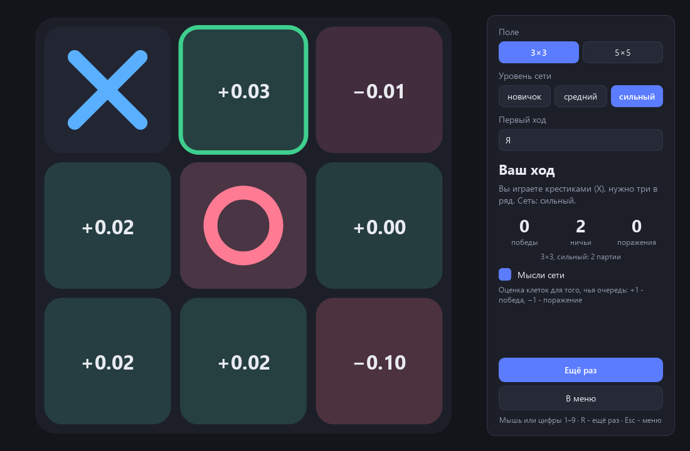
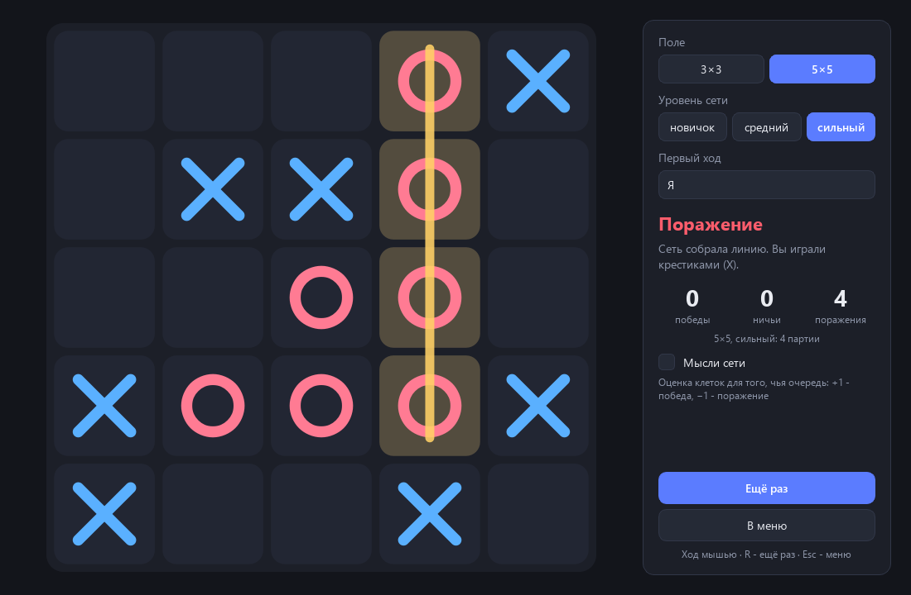
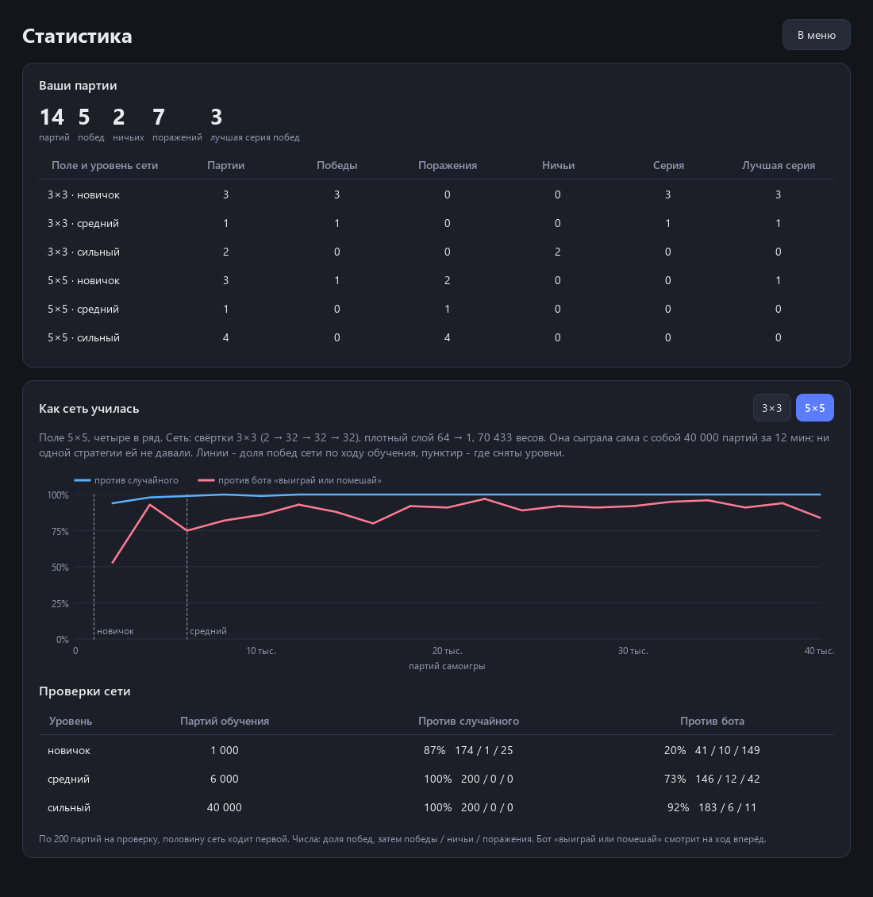
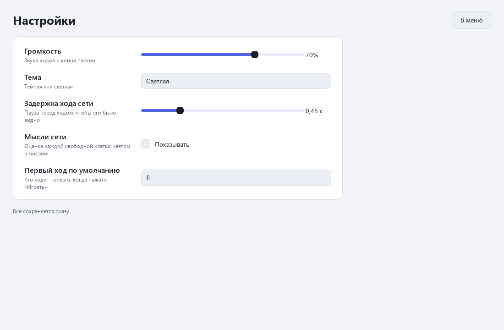

<div align="center">

# Крестики-нолики с нейросетью

**Вы играете против нейросети, которой не рассказали ни одной стратегии. Она научилась сама: сыграла с собой десятки тысяч партий и смотрела только на то, кто выиграл.**

[Скачать для Windows](https://github.com/ALEXalesha/TicTacToeAi/releases/latest) &nbsp;·&nbsp; [English version of this file](README.md)

[](https://github.com/ALEXalesha/TicTacToeAi/actions/workflows/ci.yml)
[](https://github.com/ALEXalesha/TicTacToeAi/releases/latest)
[](LICENSE)



</div>

Два поля:

- **3×3, три в ряд** - обычные крестики-нолики. Сильная сеть здесь не проигрывает никогда: это проверено полным перебором всех ходов соперника.
- **5×5, четыре в ряд** - игра заметно сложнее, и здесь видно, насколько сеть научилась.

У каждого поля три уровня сети: «новичок», «средний» и «сильный». Это снимки одного и того же обучения - в начале, в середине и в конце.

Правила (чей ход, свободна ли клетка, кто собрал линию, ничья) написаны обычным кодом. Сеть их не знает, она только оценивает позиции.

## Экраны

**Меню**: Играть, Статистика, Настройки, Выход.

**Партия.** Справа выбор поля, уровня сети и того, кто ходит первым: я, сеть или по очереди. Крестики всегда ходят первыми. Ход делается мышью, на поле 3×3 ещё и цифрами 1-9 (слева направо, сверху вниз, как подписано в клетках). Перед ходом сети короткая пауза, чтобы ход было видно. Выигрышная линия подсвечивается. Кнопки «Ещё раз» (или R) и «В меню» (или Esc).



**Мысли сети.** Переключатель на панели партии. В каждой свободной клетке появляется число от −1 до +1: как сеть оценивает ход туда для того, чья сейчас очередь. +1 - «после этого хода я выиграю», −1 - «проиграю», около нуля - ничья. Зелёный - хорошо, красный - плохо, лучшая клетка обведена. Мысли показываются и на вашем ходу: видно, что сеть посоветовала бы вам.

На картинке вверху сеть уже поставила нолик в центр после крестика в углу, и почти все оценки около нуля: сильная сеть знает, что при правильной игре здесь ничья. Хуже всего для крестиков угол напротив (−0.10).

**Статистика.** Ваши партии по полю и уровню: партии, победы, поражения, ничьи, текущая и лучшая серия побед. Ниже - как сеть училась: кривая доли побед по ходу обучения и итоги проверок каждого уровня.



**Настройки**: громкость, тема (тёмная или светлая), задержка хода сети, мысли сети, кто ходит первым по умолчанию. Сохраняются сразу.



Звуки (ход крестика, ход нолика, победа, поражение, ничья) синтезируются кодом на numpy, файлов со звуками в программе нет.

Окно открывается там, где его закрыли, тем же правилом, что в других программах автора: если монитор отключили или размер не влезает, окно всё равно появляется там, где его видно.

## Как устроена сеть

Сеть оценивает позицию **после хода**: «что будет, если я пойду сюда». Для хода она по очереди примеряет каждую свободную клетку и выбирает ту, где оценка выше. Это и есть её «мысли» на экране.

На входе поле глазами того, кто только что сходил: две плоскости 0/1 - «свои камни» и «чужие». Поэтому одна и та же сеть играет и крестиками, и ноликами. На выходе одно число в (−1, 1) через tanh: ожидаемый исход для сходившего.

| Поле | Сеть | Весов |
|---|---|---|
| 3×3 | плотная: 18 → 64 → 64 → 1, ReLU | 5 441 |
| 5×5 | свёртки 3×3: 2 → 32 → 32 → 32, затем плотный слой 64 → 1 | 70 433 |

Свёртки нужны на 5×5: четыре в ряд - один и тот же узор в любом месте поля, и свёртка узнаёт его везде одними и теми же весами. Три свёртки 3×3 подряд видят квадрат 7×7, то есть всё поле.

Никакого PyTorch: слои, обратное распространение ошибки и оптимизатор Adam написаны на numpy (папка `nn/`, взята из соседнего проекта нейро-змейки и дополнена tanh). Каждый градиент в тестах сверяется с численным.

## Как сеть училась

Сеть играет сама с собой, по 64 партии сразу: все возможные ходы во всех партиях оцениваются одним проходом сети. Часть ходов случайные, чтобы сеть видела не только свои любимые позиции: сначала 30 %, к концу обучения 5 %.

После партий каждая позиция получает цель - число, к которому сеть должна подтянуть свою оценку:

- если этим ходом партия кончилась - победа 1, ничья 0;
- иначе цель складывается из двух частей: оценки лучшего ответа соперника (как в минимаксе) и того, чем партия на самом деле закончилась. Доля второй части - λ = 0.7, это TD(λ). С соперником знак меняется: что хорошо ему, плохо мне;
- каждый шаг назад от конца партии умножает цель на γ (0.95 на 3×3, 0.97 на 5×5): быстрая победа ценится выше долгой;
- если соперник ответил случайным ходом, итог партии для предыдущей позиции ничего не значит, и цель берётся только из лучшего ответа.

Одна тонкость. Оценка «лучшего ответа соперника» - на 10 % средняя по всем его ответам, а не только лучшая. Чистый минимакс считает все ничейные ходы одинаковыми, и сеть играла бы против слабого соперника вяло. С этой добавкой она из равных ходов выбирает тот, где соперник вероятнее ошибётся. Проигрышный ход добавка не оправдает: проигрыш стоит −1, а она прибавляет не больше 0.1.

Каждая позиция превращается в 8 примеров: поле можно повернуть 4 раза и отразить, исход от этого не меняется. Примеры копятся в буфере последних позиций, сеть учится на случайных пачках из него по среднему квадрату ошибки.

Сколько это заняло (4 потока процессора):

- 3×3: 30 000 партий, 11 секунд;
- 5×5: 40 000 партий, 12 минут.

Обучить заново:

```
python -m train.selfplay --size 3
python -m train.selfplay --size 5
```

## Уровни и проверки

Каждый уровень после обучения сыграл по 200 партий против ботов, половину партий сеть ходила первой. Боты нужны только для проверки, сеть у них не училась:

- **случайный** ходит в любую свободную клетку;
- **«выиграй или помешай»** смотрит на ход вперёд: выигрывает, если может, иначе закрывает клетку, которой соперник выиграл бы следующим ходом, иначе ходит случайно;
- **минимакс** (только 3×3) перебирает всю игру до конца и не проигрывает никогда.

Числа - победы / ничьи / поражения сети.

**3×3**

| Уровень | Партий обучения | Против случайного | Первой против случайного | Против «выиграй или помешай» | Против минимакса |
|---|---|---|---|---|---|
| новичок | 600 | 125 / 9 / 66 | 164 / 13 / 23 | 11 / 29 / 160 | 0 / 26 / 174 |
| средний | 3 000 | 184 / 10 / 6 | 191 / 9 / 0 | 25 / 126 / 49 | 0 / 155 / 45 |
| сильный | 30 000 | 193 / 7 / 0 | 197 / 3 / 0 | 61 / 139 / 0 | **0 / 200 / 0** |

Сильная сеть не проиграла минимаксу ни одной партии из 200, а первой против случайного выиграла 98.5 %. Двести партий - это выборка, поэтому есть и проверка сильнее: полный перебор. Сеть ходит своим ходом, а за соперника перебираются вообще все ходы, не только лучшие. Сильная сеть не проигрывает ни одной такой партии, ни крестиками, ни ноликами. «Средний» уровень крестиками тоже не проигрывает никому, а ноликами - уже проигрывает.

**5×5, четыре в ряд**

| Уровень | Партий обучения | Против случайного | Первой против случайного | Против «выиграй или помешай» |
|---|---|---|---|---|
| новичок | 1 000 | 174 / 1 / 25 | 181 / 0 / 19 | 41 / 10 / 149 |
| средний | 6 000 | 200 / 0 / 0 | 198 / 0 / 2 | 146 / 12 / 42 |
| сильный | 40 000 | 200 / 0 / 0 | 200 / 0 / 0 | **183 / 6 / 11** |

Бот «выиграй или помешай» на 5×5 не так прост: одиночную угрозу он закрывает всегда. Чтобы его обыграть, нужна вилка - две угрозы сразу. Сильная сеть этому научилась и выигрывает 91.5 % партий, хотя никто ей про вилки не говорил. «Новичок» проигрывает тому же боту три партии из четырёх.

Все числа лежат в паспортах моделей `models/3x3.json` и `models/5x5.json` вместе с кривой обучения и настройками. Тесты пересчитывают каждую проверку заново теми же сидами и сверяют с паспортом до партии.

## Данные

Настройки, статистика и место окна - в `%LOCALAPPDATA%\TicTacToeAi` (`settings.json`, `stats.json`, `window.json`). Если рядом с `TicTacToeAi.exe` лежит `portable.txt` (он есть в portable-архиве), всё пишется в папку `saves` рядом с программой. Испорченный файл не мешает: вместо него берутся значения по умолчанию.

## Запуск

### Готовая сборка для Windows

В разделе релизов два файла, оба ничего не требуют от системы - Python, numpy и Qt внутри:

- `TicTacToeAi-1.0.0-portable.zip` (60 МБ): распаковать и запустить `TicTacToeAi.exe`;
- `TicTacToeAi-1.0.0-setup.exe` (43 МБ): установщик с ярлыками и деинсталлятором. Прав администратора не просит, ставится в профиль пользователя.

### Из исходников

Нужны Python 3.11 или новее, numpy и PySide6:

```
pip install -r requirements.txt
python main.py
```

Самопроверка без экрана - окно создаётся в памяти, сеть играет против бота на обоих полях, итог пишется в файл:

```
python main.py --selftest итог.txt
```

Собранный `TicTacToeAi.exe` понимает тот же флаг. Статистику игрока самопроверка не трогает: пишет во временную папку.

Собрать установщик и portable-архив самому (нужны PyInstaller, Pillow и NSIS):

```
pip install pyinstaller pillow
python build.py
```

Кадры для этого файла тоже делает программа - окно без экрана, снимок через `widget.grab()`:

```
python tools\make_previews.py
```

## Тесты

```
python -m pytest
```

199 тестов, около 30 секунд:

- слои сети: градиенты сверяются с численными, сохранение и загрузка весов;
- правила: победы по строкам, столбцам и диагоналям на 3×3 и 5×5, в том числе четыре в ряд не от края, ничья, занятая клетка, чей ход;
- сеть: 8 симметрий дают 8 разных полей и обратимы, ход только в свободную клетку;
- обучение: цели TD(λ) на готовых партиях, короткое обучение улучшает игру;
- обученные модели: пороги проверок и совпадение с паспортами;
- окно без экрана: партия мышью и цифрами до конца, «Ещё раз» и «В меню», каждый экран рисуется в обеих темах, настройки и статистика сохраняются и переживают битый файл, место окна, звуки нужной длины;
- самопроверка и сборка.

**Мутационная проверка.** Чтобы убедиться, что тесты ловят настоящие ошибки, код ломался нарочно, по одной поломке за раз, и каждый раз гонялись все тесты:

| Поломка | Упало тестов |
|---|---|
| правило победы не видит обратную диагональ | 11 |
| для победы хватает k−1 в ряд | 20 |
| градиент tanh без квадрата | 2 |
| градиент плотного слоя: смещение не учится | 3 |
| статистика не сохраняется в файл | 2 |
| ничья записывается как победа | 1 |
| сеть выбирает худший ход вместо лучшего | 16 |
| в цели обучения потерян знак соперника | 4 |

Все восемь поломок пойманы.

## Устройство

| Папка / файл | Что делает |
|---|---|
| `nn/` | слои на numpy: плотный, свёртка 3×3, ReLU, tanh, Adam, сохранение `.npz` |
| `core/rules.py` | поле, ходы, победа k в ряд, ничья |
| `core/net.py` | сеть оценки позиции, симметрии, выбор хода |
| `core/bots.py` | боты для проверок: случайный, «выиграй или помешай», минимакс |
| `train/selfplay.py` | обучение самоигрой, уровни, паспорт |
| `game/` | окно Qt: экраны, поле, график, темы, звуки, настройки, статистика, место окна |
| `models/` | обученные веса и паспорта |
| `tests/` | pytest |

## Стек

Python · NumPy · PySide6 (Qt 6) · PyInstaller · NSIS

## Лицензия

MIT, см. [LICENSE](LICENSE).
